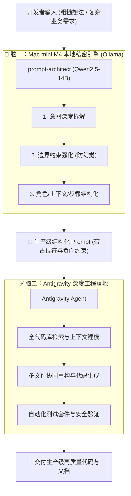

# 🧠 Dual-Brain Prompt (双脑协同提示词与开发工作流)

> **Mac mini M4 (本地 14B 提示词架构师) × Antigravity (主驾驶编程智能体)**  
> 打造私密、零成本试错、高确定性的端到端 AI 研发工作流。

---

## 🏛️ 双脑协同架构



---

## 🌟 核心优势

1. **零 Token 成本与无限制推演**：
   日常的大量 Prompt 构思、试错与格式重构完全在本地 M4 的 16GB 统一显存中运行（100% GPU 加速，静音且低温），不消耗任何云端 API 额度。
2. **私密与合规屏障**：
   本地业务关键词、内网数据格式在本地 14B 模型中先完成通用化脱敏与提纯，再提交给工程智能体。
3. **消除大模型幻觉**：
   本地模型专门调校了严格的 `Constraints`（负向约束）与 `Few-Shot` 填槽机制，让 Antigravity 的执行极具确定性。

---

## 🚀 快速上手

### 1. 环境准备
确保本地 Ollama 正在运行，且已载入 `prompt-architect` 模型：
```bash
# 检查健康状态与模型列表
python3 -m src.cli check
```

### 2. 优化你的提示词
```bash
# 生成完整的诊断报告与结构化 Prompt
python3 -m src.cli optimize "写一个给大模型的提示词：审查Python代码中的SQL注入与权限漏洞"

# 仅输出可直接复制的 Prompt 代码块（适合管道重定向）
python3 -m src.cli prompt-only "设计一个统一异常处理与日志追踪中间件" | pbcopy
```

---

## 🛠️ Antigravity 原生联动

本项目自带 `.agents/` 工作区原生定制支持：

1. **工作区规则 (`.agents/rules/dual-brain-protocol.md`)**：
   在当前目录打开 Antigravity 时，Agent 会自动遵循双脑协同协议：遇到模糊复杂需求，优先调度本地 M4 进行提示词提纯。
2. **工作区技能 (`.agents/skills/local-prompt-refine/SKILL.md`)**：
   Antigravity 可在后台自主调用本地 CLI 执行优化任务。

---

## 📂 工程目录一览

```text
dual-brain-prompt/
├── .agents/                                # Antigravity 原生配置
│   ├── rules/
│   │   └── dual-brain-protocol.md          # 智能体协同行为准则
│   └── skills/
│       └── local-prompt-refine/
│           └── SKILL.md                    # 本地提示词优化技能定义
├── src/                                    # 核心驱动模块（零第三方依赖）
│   ├── __init__.py
│   ├── config.py                           # Ollama 端点与 16k 上下文配置
│   ├── engine.py                           # 本地 M4 模型通信与解析器
│   └── cli.py                              # 命令行交互工具
├── templates/                              # 预置生产级 Prompt 模板
│   ├── code_review.md                      # 代码安全与规范审查
│   ├── refactoring.md                      # 渐进式无损重构
│   └── architecture_design.md              # 云原生系统架构设计
├── tests/
│   └── test_engine.py                      # 单元与连通性测试套件
├── .gitignore
├── README.md
└── requirements.txt
```

---

## 🧪 运行测试

```bash
python3 -m unittest discover tests/
```
