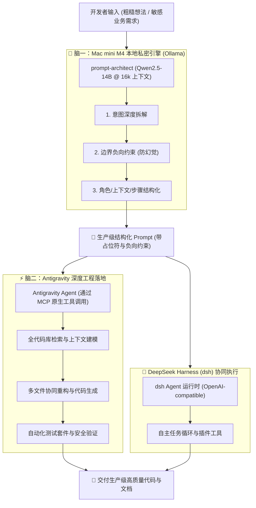

# 🧠 Dual-Brain Prompt Plugin (双脑协同 Antigravity 插件)

> **Mac mini M4 (本地 14B 提示词架构师) × Antigravity (主驾驶编程智能体) × DeepSeek Harness (dsh)**  
> 打造私密、零 Token 成本试错、高确定性的端到端 AI 研发工作流与原生 Antigravity 插件。

---

## 🏛️ 双脑协同架构 (Dual-Brain Architecture)



---

## 🌟 核心特性与硬件优化

* **16GB M4 深度调优**：
  * 基于 `Qwen2.5-14B-Instruct`（Q4_K_M），模型体积 9.9 GB。
  * 开启 **Flash Attention** 与 **Q8_0 KV Cache**，上下文原生扩容至 **16,384 tokens**（16k）。
  * 运行时显存占用约 11 GB，**100% 运行在 Apple Silicon Metal GPU 统一内存**中，零 Swap 换页，推理速度稳定在 **10~15 tokens/s**。
* **零成本无限推演**：
  * 日常大量的提示词设计、意图拆解与格式调试全部在本地离线运行，不消耗任何在线 API 额度。
* **隐私物理隔离**：
  * 内部业务术语、敏感架构信息先在本地提纯重构，脱敏后再交付给云端智能体。

---

## 🔌 插件工程结构

本项目完全对齐 **Antigravity 官方插件规范**：

```text
dual-brain-prompt/
├── plugin.json                 # 插件元数据声明清单
├── mcp_config.json             # 原生 MCP Server 配置 (Eager 装载)
├── rules/
│   └── AGENTS.md               # 插件内置双脑协同规范 (提示词提纯准则)
├── skills/
│   └── local-prompt-refine/
│       └── SKILL.md            # 提示词优化工作流技能
├── src/                        # 核心引擎驱动模块（标准库实现，零第三方依赖）
│   ├── config.py               # Ollama 连接与 16k 上下文配置
│   ├── engine.py               # 本地通信、降级与三段式结构解析器
│   ├── mcp_server.py           # 原生 Stdio JSON-RPC 2.0 服务端
│   └── cli.py                  # 本地独立命令行工具
├── templates/                  # 预置生产级 Prompt 模板
│   ├── code_review.md          # 严谨代码安全与规范审查
│   ├── refactoring.md          # 渐进式无损重构
│   └── architecture_design.md  # 云原生高可用架构设计
└── tests/                      # 单元与端到端测试套件
```

---

## 🚀 安装与部署

### 本地大模型一键拉取与编译部署
在新机器或未安装模型的环境下，执行模型部署脚本：
```bash
./deploy_model.sh
```
该脚本会自动：
1. 检测操作系统与芯片架构（Apple Silicon M4 自动开启 Metal GPU 统一内存硬件加速）。
2. 检测 Ollama 安装与运行状态（未安装尝试自动通过 Homebrew 安装，未运行自动唤起后台守护）。
3. 自动从官方模型库拉取开源基座模型 `qwen2.5:14b`（约 9.9 GB）。
4. 读取项目中的 `Modelfile`，注入专属系统提示词并扩充至 **16,384 tokens** 上下文，编译生成定制的 `prompt-architect:latest`。
5. 自动运行本地端到端推理自检，确认模型输出符合三段式规范。

### 一键部署插件到 Antigravity（推荐）
在工程根目录下执行插件安装脚本：
```bash
./install.sh
```
该脚本会自动：
1. 校验 Python 3 运行时环境。
2. 连通性测试后端服务（默认通过 Cloudflare Tunnel 域名 `https://ai.evasi0nxiao.com` 代理至本地 M4 引擎）。
3. 赋予 MCP 与 CLI 脚本必要的可执行权限。
4. 建立软链接部署至全局插件目录 `~/.gemini/config/plugins/dual-brain-prompt`。
5. 自动向 Stdio 发送 JSON-RPC 进行 MCP 工具注册握手验证。

---

## 💡 使用指南

### 1. 在 Antigravity 中原生使用（推荐）
插件部署后，Antigravity 会自动加载 `dual-brain-prompt` 插件。在任何工程会话中对话，直接自然语言呼叫：
> **“用本地模型帮我优化这个提示词：写一个带指数退避重试与熔断的 HTTP 客户端”**

Antigravity 会自动触发原生的 `optimize_prompt` MCP 工具，并在 Mac M4 上本地运算返回生产级结构化 Prompt。

### 2. 在 DeepSeek Harness (`dsh`) 中接入
支持直接通过私有域名 `https://ai.evasi0nxiao.com/v1` 或本地 `http://127.0.0.1:11434/v1` 访问。
后端已在 Cloudflare 边缘端配置 WAF API Key 鉴权（默认 Key 为 `Xiaoyao0903`）。

在 `~/.dsh/settings.yaml` 的 `llm-pi-ai.providers` 下配置：
```yaml
ollama:
  displayName: "Prompt Architect (M4 本地引擎)"
  api: "openai-completions"
  baseURL: "https://ai.evasi0nxiao.com/v1"
  models:
    - id: "prompt-architect"
      name: "Prompt Architect (14B 提示词优化)"
      contextWindow: 16384
      maxTokens: 4096
    - id: "qwen2.5:14b"
      name: "Qwen 2.5 (14B)"
      contextWindow: 16384
      maxTokens: 4096
  apiKeyEnv: OLLAMA_API_KEY
```
> **提示**：无需在 Shell 环境变量中写死 Key，直接在 **dsh Web 界面**（设置 -> 模型提供商 -> Ollama / Prompt Architect）的 **API Key 输入框** 中填入 `Xiaoyao0903` 并保存即可！

### 3. 命令行独立使用 (CLI)
```bash
# 检查后端引擎连接状态
python3 -m src.cli check

# 完整诊断报告与结构化输出
python3 -m src.cli optimize "实现一个安全的密码哈希校验函数"

# 仅提取 Prompt 并复制到系统剪贴板（适合管道串联）
python3 -m src.cli prompt-only "设计一个统一异常处理与追踪中间件" | pbcopy
```

---

## 🧪 运行测试

```bash
python3 -m unittest discover tests/
```

---

## 📄 License
MIT License.
