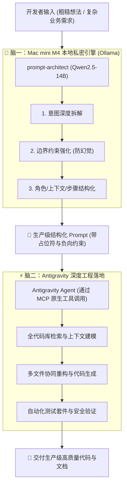

# 🧠 Dual-Brain Prompt Plugin (双脑协同 Antigravity 插件)

> **Mac mini M4 (本地 14B 提示词架构师) × Antigravity (主驾驶编程智能体)**  
> 打造私密、零成本试错、高确定性的端到端 AI 研发工作流与原生 Antigravity 插件。

---

## 🏛️ 双脑协同架构



---

## 🔌 插件架构与规范

本项目符合标准 **Antigravity 插件规范**：

```text
dual-brain-prompt/
├── plugin.json                 # 插件元数据声明清单
├── mcp_config.json             # 原生 MCP Server 配置 (Eager 装载)
├── rules/
│   └── AGENTS.md               # 插件内置双脑协同规范
├── skills/
│   └── local-prompt-refine/
│       └── SKILL.md            # 提示词优化工作流技能
├── src/                        # 核心引擎驱动模块
│   ├── config.py
│   ├── engine.py
│   ├── mcp_server.py           # 原生 MCP Stdio Server
│   └── cli.py                  # 本地独立命令行工具
├── templates/                  # 预置提示词模板
└── tests/                      # 单元与集成测试套件
```

---

## 🚀 日常使用

### 1. 在 Antigravity 中直接使用（自然语言）
因为已安装为全局插件，在任何项目对话中直接说：
> *“用本地模型帮我优化这个提示词：写一个带重试的 HTTP 客户端”*

Antigravity 会自动通过 MCP 原生工具 `optimize_prompt` 调用本地 M4 芯片计算并返回。

### 2. 命令行工具（终端独立使用）
```bash
# 检查健康状态
python3 -m src.cli check

# 完整诊断与优化
python3 -m src.cli optimize "实现一个安全的密码哈希校验函数"

# 仅输出纯净 Prompt 并复制到剪贴板
python3 -m src.cli prompt-only "设计一个统一错误处理中间件" | pbcopy
```

---

## 🧪 测试

```bash
python3 -m unittest discover tests/
```
